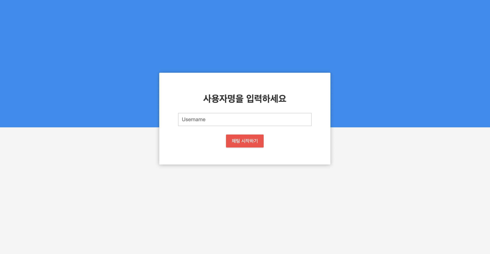
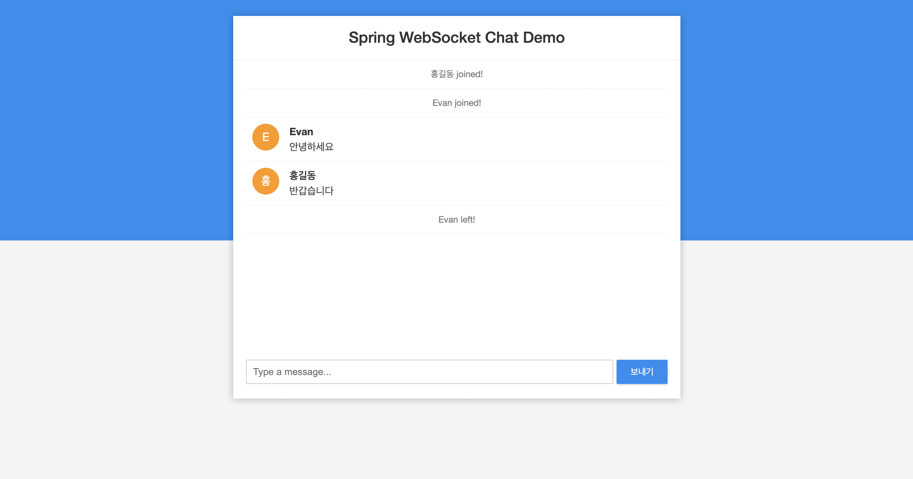

# Spring Websocket

## 개발 환경
- Spring Boot v2.5.9
- Spring WebSocket

## Branch
- `chatting-server` : 여러개의 채팅방 서버
- `chatting-basic` : 하나의 채팅방 일괄 서버

## WebSocket

Web Browser에서 Request를 보내면 Server는 Response를 줍니다.

HTTP 통신의 기본적인 동작 방식입니다.

하지만 Server에서 Client로 특정 동작을 알려야 하는 상황도 있다.

예를 들어 Browser로 Facebook에 접속해 있다가 누군가 친구가 글을 등록하는 경우, 혹은 Web Browser로 메신저를 구현하는 경우가 있습니다.

WebSocket이란 Transport protocol의 일종으로 쉽게 이야기하면 웹버전의 TCP 또는 Socket이라고 이해하면 됩니다.

WebSocket은 서버와 클라이언트 간에 Socket Connection을 유지해서 언제든 양방향 통신 또는 데이터 전송이 가능하도록 하는 기술입니다. 주로

Real-time web application구현을 위해 널리 사용되어지고 있습니다. (SNS 애플리케이션, LoL 같은 멀티플레이어 게임, 구글 Doc, 증권거래, 화상채팅 등)

## WebSocket Sevrer를 운용할 때의 유의사항

HTTP에서 동작하나, 그 방식이 HTTP와는 많이 상이하다.

- REST 한 방식의 HTTP 통신에서는 많은 URI를 통해 application이 설계된다.
- WebSocket은 하나의 URL을 통해 Connection이 맺어지고, 후에는 해당 Connection으로만 통신한다
- WebSocket은 먼저 서버와의 정기적인 HTTP 연결을 설정 한 다음 Upgrade헤더를 전송하여 양방향 웹 소켓 연결로 업그레이드합니다.

Handshake가 완료되고 Connection을 유지한다.

- 전통적인 HTTP 통신은 요청-응답이 완료되면 Connection을 close 한다. 때문에 이론상 하나의 Server가 Port 수의 한계(n <65535)를n<65535 넘는 client의 요청을 처리할 수 있다.
- WebSocket은 Connection을 유지하고 있으므로, 가용 Port 수만큼의 Client와 통신할 수 있다.

## 채팅 프로그램

